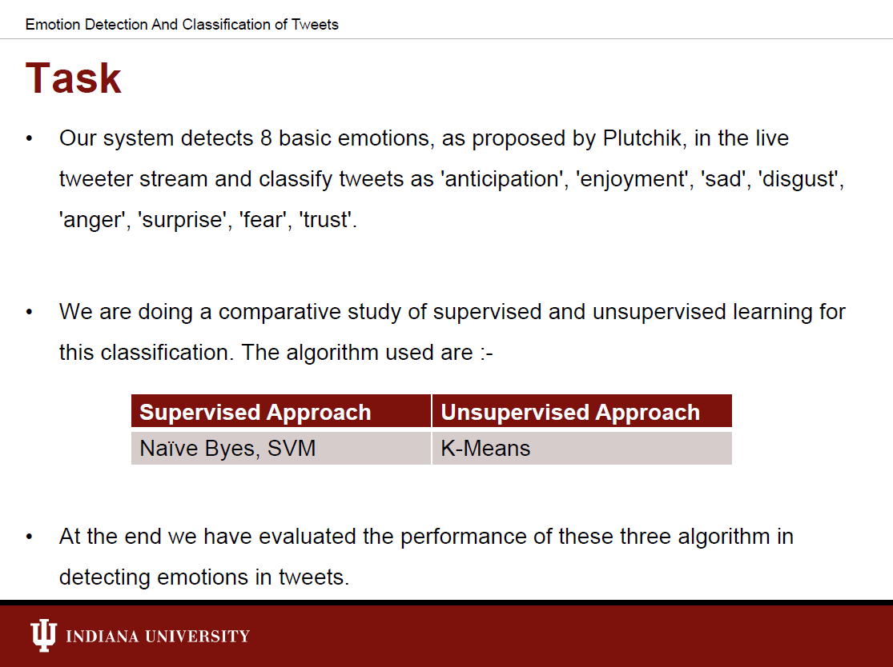
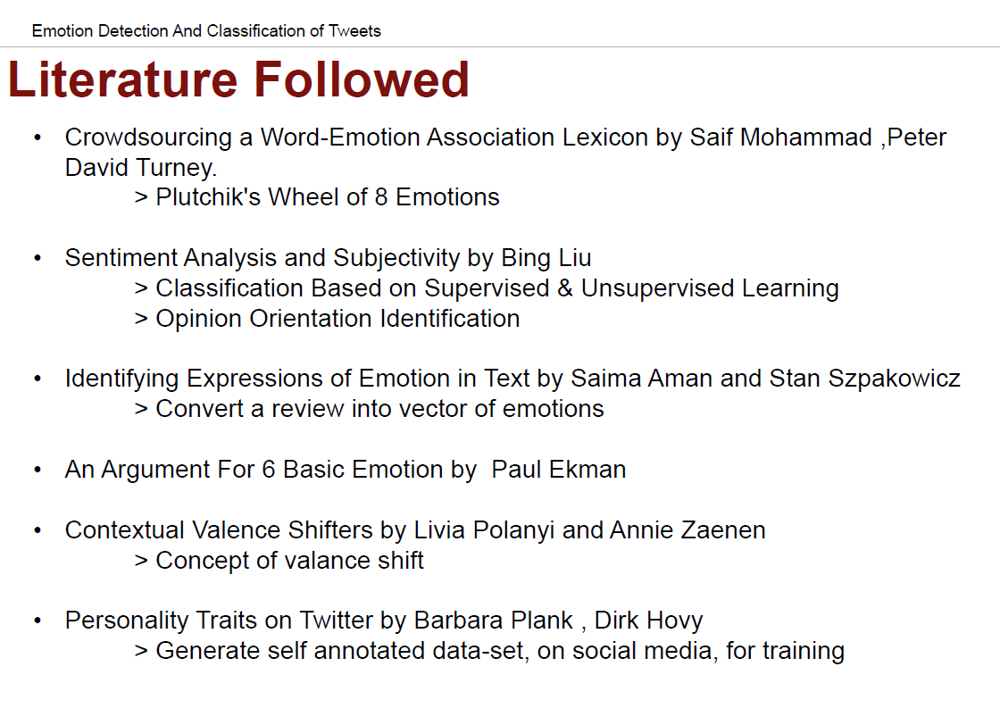
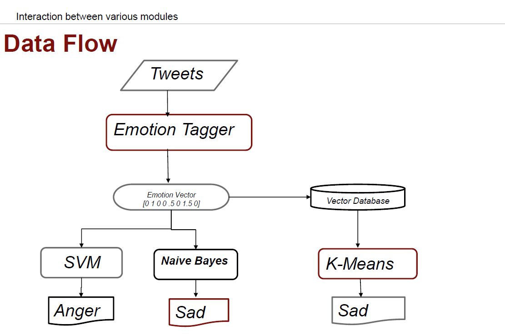
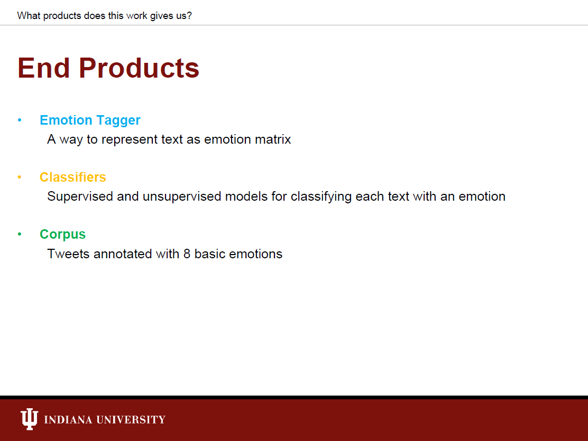
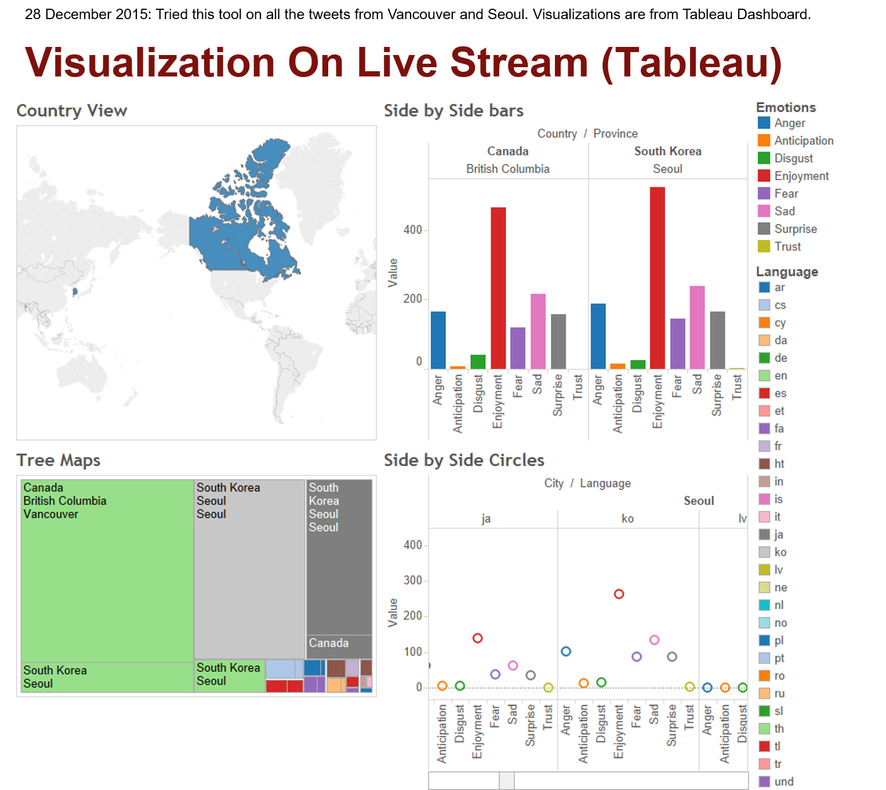

## Emotion Detection And Classification of Tweets

### How to Run
- Go to your terminal.

- Clone this repository and go inside it
	```
	git clone https://github.com/mjaglan/PyTextSentiment.git
	cd PyTextSentiment
	```

- Edit following files:
	```
	app/assets/BingCredentials/bingClientId.txt
	app/assets/BingCredentials/bingClientSecret.txt
	app/assets/TwitterAPI/credentials.txt
	app/assets/input.txt
	```

- Run the following script
	```
	. ./restart-all.sh
	```


### Web UI

- This application inside docker container page can be browsed at [http://CONTAINER-IP:9091/](http://0.0.0.0:9091/)


### Project Structure
- Training dataset files: ```app/assets/Resource/searchKeys```
- Get Feeds by text search query: ```app/assets/Resource/searchKeys/testFiles```
- Bag of Words for emotion tagging and classification: ```app/assets/Resource```
- Output twitter data directory: ```app/assets/twitterData```


### Project Overview

The term paper of this work is present [here](Documents/term_paper.pdf). Below are the highlights of the work done + the results generated for live tweets on 28 December 2015.


***

***

***

***



### References
- [Bing Package](https://github.com/openlabs/Microsoft-Translator-Python-API)
- [TwitterAPI Package](https://github.com/geduldig/TwitterAPI) and [TwitterAPI end point requests](https://github.com/geduldig/TwitterAPI/blob/master/TwitterAPI/constants.py)
- [Google Geo Package](https://pypi.python.org/pypi/geocoder)
- [Scikit-learn Package](https://github.com/scikit-learn/scikit-learn)
- [Twitter Application Management](https://apps.twitter.com/)
- [Stream API Request Parameters](https://dev.twitter.com/streaming/overview/request-parameters)
